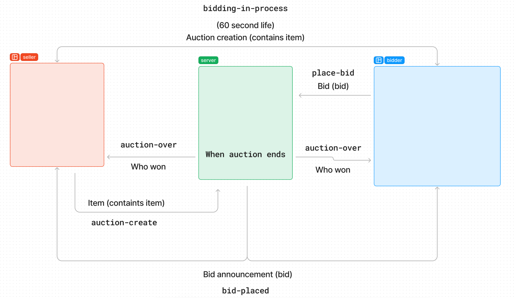

# Auction Simulator

## Authors

**Amanda Marquez, Ryan Potts, Adam Jimenez, Jedidiah Staley**

## Overview

This is a simulation of a bidding website run on an event-driven server. There are two client types: bidders and sellers. By opening a git terminal in each of the three folders (server, clients/bidder, and clients/seller) and running `nodemon` in all three, the user will see console logs demonstrating connectivity and communication between the 3 servers.

## UML Diagram

